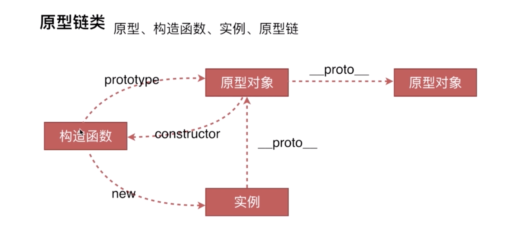
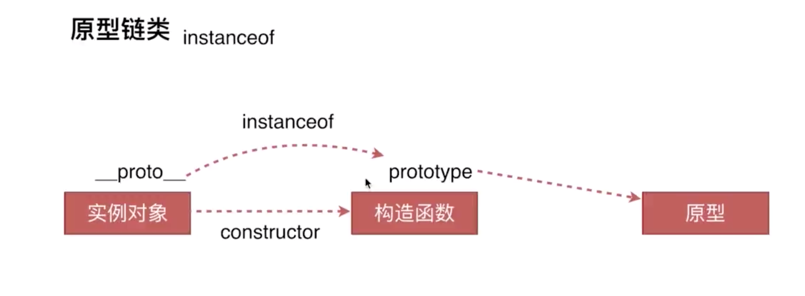

## 需要深入

1. 类型转换 -> 隐式转换 -> 题目    typeof instanceof
2. 


## 准备

- JD描述
- 简历如何写
- 知识如何整理和复习
- 问题如何回答
- 项目怎么准备
- 和负责人怎么沟通
- HR印象怎么留

## 一面/二面

### 1.1 页面布局 ------ css

- 准备要充分（基础知识）
- 知识要系统
- 沟通要简洁
- 内心诚实（掌握不足，直接说，不要窝窝囊囊）
- 态度要谦虚（不要觉得面试官很水，就拿乔）
- 回答要灵活 （不要把话说的太满，总有你不知道的事情） 

### 1.2 举例子

```html
题目：
高度已知，三个div, 左边和右边宽度固定，300px, 外部高度1000px, 中间div随着屏幕宽度自适应
5种方案，具体可见 /example/layout-系列.html
```

延伸问题：

- 每个方案的优缺点

  ```html
  1. 浮动
  缺点：浮动脱离文档流，需要清浮动
  优点：兼容性比较好。如果处理好浮动之间的关系，清除浮动，还是比较好的方案
  
  2. 绝对定位
  缺点：脱离文档流，需要有个父元素作为标准定位。可使用性较差
  优点：快捷
  
  3. flex布局
  缺点： css3中显示，可能兼容性优点问题
  优点：就是为了解决浮动和绝对定位的问题，比较完美
  
  4. table布局
  缺点： 
  优点： 表格布局在很多场景中，比较适用，兼容性很好
  
  5. 网格布局
  缺点：
  优点： 之前的栅格化东西，代码量简化很多，可以展示自己的新技术掌握度
  ```

  

- 假设把高度去掉，如果中间的由于内容过度而撑开，左右两边都需要随着自适应

  ```html
  答案： 只有flex布局和table布局不受影响
  
  ```

  

- 在业务需求中 ，哪个方案兼容性更好

- 拔高

  - 三栏布局

    - 左右高度固定， 中间自适应
      `/example/layout-left-right-fixed.html`

    - 上下高度固定， 中间自适应

      `/example/layout-top-bottom-fixed.html`

  - 两栏布局

    - 左边宽度固定 ，右边自适应
      `/example/layout-left-fixed.html`
    - 右边宽度固定，左边自适应
    - 上边高度固定，下边自适应
    - 下边高度固定，上边自适应

### 1.3 css 盒模型

难度层层递进

- 基本概念： 标准模型 + IE模型

- 标准模型和IE模型的区别

  >标准模型的宽和高，只是content的宽高
  >IE模型的宽和高， 是content + padding + border 

  

- CSS如何设置这两种模型

  >box-sizing: content-box;     标准模型 浏览器默认格式
  >
  >Box-sizing: border-box;       IE模型    需要设置

- JS如何设置获取盒模型的宽高

  - dom.style.width/height    ---- 只能取出内联样式的宽高
  - dom.currentStyle.width/height  --- 拿到渲染结果后的样式，相对准确，但是只有IE支持
  - window.getComputedStyle(dom).width/height -- 兼容forfix ,chrome
  - dom.getBoundingClientRect().width/height  --- viewport的左上角作为定点。拿到top, left, height, width

- 实例题（根据盒模型解释边距重叠）

  - 空元素上下margin， 取最大值为最终margin

  - 兄弟元素，如 上兄弟的margin-bottom:50px; 下兄弟的margin-top: 10px;   最终中间的距离为最大值50px

  - 父子之间， 

    ```css
    .foo{background: red;} 
    .son {background: yellow; margin-top:10px; height: 100px;}
    问: 此时.foo的高度是多少
    答： 100px;
    
    修改样式：
    .foo{background: red; overflow:hidden;} 
    答： 110px;
    ```

- BFC（边距重叠解决方案）  或者IFC
  **上例中，`.foo{overflow:hidden}`,便是BFC（box formating context）**

  - 基本概念：块级格式化上下文
  - BFC的原理：渲染原理 
    - 在BFC的垂直方向的边距会发生重叠
    - BFC的区域不会与浮动元素的box发生重叠，清除浮动
    - BFC在页面上，是一个独立的元素，外面的元素不会影响到里面的元素
    - 计算BFC高度时，浮动元素也会参与计算

  - 如何创建BFC
    - float的值不是none   **left, right**
    - position 的值不是static或者relative   **absolute, fixed**
    - display属性是inline-block,或者table-cell   **inline-block  table-cell table-rows table-column**
    - overflow不是auto， **hidden, scroll**

  - BFC的使用场景

    

整个过程，从理论到事件再到理论

### 1.4 DOM事件类

- **基本概念：** DOM事件的级别

  ```js
  DOM0   element.onclick = function(){}
  DOM2   element.addEventListener('click', function(){}, false)   IE： atouchEvent
  DOM3   element.addEventListener('keyup', function(){}, false);
  
  //说明
  1. 有DOM1标准，只不过是DOM1没有涉及到事件标准
  2. DOM3是除了click事件，多了一些事件方法,如鼠标事件，键盘事件
  /**
  DOM2 DOM3中最后一个参数：默认为true, 表示捕获间触发
  设置为true, 表示捕获阶段触发
  */
  ```

- **DOM事件模型**  --- 指的就是 冒泡和捕获
  捕获： 从上到下，从外围包围中心

  冒泡： 从目标元素到最外层，一层层触发

- **DOM事件流**
  比如点击鼠标左键，从点击这一刻开始，到页面上触发事件，这一过程就是事件流

  > 事件流分三阶段： 
  >
  > 第一阶段 是捕获，捕获事件到目标阶段
  >
  > 第二阶段 事件通过捕获到达目标元素，
  >
  > 第三阶段 从目标元素上传到window对象 

- **面试DOM事件捕获的具体流程**
  事件捕获，第一个接收到事件的对象是window

  window    =>    document   =>  html   => body => div

  - 如何获取html标签：document.documentElement

- Event事件的常见应用

  - event.preventDefault()---阻止默认行为
    比如： 可以组织a标签的浏览器自带行为
  - event.stopPropagation()  --- 阻止冒泡
    如： 子元素绑定一个事件，父元素也绑定一个事件
  - event.stopImmeidatePropagation()   --- 
    如： 一个按钮绑定了两个事件，A & B，在A的响应中加入event.stopImmeidatePropagation() ， B便不会触发
  - event.currentTarget
    当前被绑定事件的元素
  - event.target
    当前被点击的元素

- **自定义事件**

  ```js
  方法1：
  var eve = new Event('custome');
  dom.addEventListener('custome', function(){
    console.log('dom定义事件');
  });
  dom.dispatchEvent(eve);  //触发事件
  
  
  方法2： CustomEvent
  /**
  区别： CustomEvent可以指定自定义事件参数，而Event只能定义事件名。 
  如： CustomEvent('custome', {name:'lianlian', age: 18})
  
  */
  ```

### 1.4 类型转换

- 数据类型
  ECMScript 标准定义了7种数据类型

  - 原始类型
    `Boolean`, `String`, `Null`,`Number`, `Undefined`,`Symbol`
  - 对象
    `Object`

- 显示类型转换
  调用下面任意一种方法，改变数据类型

  Number()

  ```js
  //原始类型对象
  //数字，那就是数字
  //字符串    ’123abc‘ => NaN     '123' => 123    '' => 0
  //布尔值    true => 1  false => 0 
  //Undefined => NaN
  //Null => 0
  
  
  //如果参数为对象obj  valueOf toString
  1. obj.valueOf() => 原始值？ => 直接转换；
  2. obj.valueOf() => obj_2 => obj_2.toString() => 原始值？ => 直接转换；
  3. obj.valueOf() => obj_2 => obj_2.toString() => obj_3 => 报错
  //举例
  Number({a: 1}) //NaN
  过程：let val = {a: 1}
  			val.valueOf() = {a: 1}; //不是原始值
  			val.toString() = "[Object, Object]"
  			Number("[Object, Object]");
  ```

  String()

  ```js
  //原始类型转换
  //数字： 123 => '123'
  //字符串： 'abc' => 'abc'
  //布尔值： true => 'true' false => 'false'
  //undefined  => 'undefined'
  //null => 'null'
  
  //参数为对象obj  toString  valueOf
  1. obj.toSting() => 原始值？ => 直接转换；
  2. obj.toSting() => obj_2 => obj_2.valueOf() => 原始值？ => 直接转换；
  3. obj.toSting() => obj_2 => obj_2.valueOf() => obj_3 => 报错
  //举例
  var b = {
    b: 1,
    toString: function(){
      return {
        b: 2
      }
    },
    valueOf: function(){
      return 'b'
    }
  }
  
  String(b);  //b
  步骤： 调用b.toString() 方法，返回的是对象，那么就再次调用b.valueOf()
  ```

  Boolean()

  ```js
  //原始值类型转换
  undefined
  null
  -0                   =>   false
  +0            
  NaN
  ''
  -----------------------------------------------------------------
    其他都是true
  
  
  ```

  

- 隐式类型转换

  - 四则运算  + - * /

  - 判断语句  if

  - Native 调用  console.log()  转换成字符串   alert()  转换成字符串  背后转换的是String

  - **题目**

    ```js
    [] + []    //""  [].toString = '' 
    [] + {}    //"[Object, Object]"   
    //[].toString() = "" {}.toString() = "[Object, Object]"
    
    {} + []    //0  
    //{}被看成一个代码块，不参与运算。 那么就剩下 +[]//[].toString(); +"" = 0;
    {} + {}   
    //chrome=> "[Object, Object][Object, Object]"  
    //fireFox => NaN 第一个{}看成代码块，不参与计算； 剩下 +{} = NaN
    true + true  //1
    1 + {a: 1}    // "1[Object, Object]"
    ```

    > 在js中，加法运算的规则很简单，只会触发两种情况

    1. number + number
    2. string + string

    > 所以，
    >
    > 1. 在JavaScript隐式转换规则中首先会推算两个操作数是不是number类型，如果是则直接运算得出结果。
    > 2. 如果有一个数为string，则将另一个操作数隐式的转换为string，然后通过字符串拼接得出结果。
    > 3. 如果为布尔值这种简单的数据类型，那么将会转换为number类型来进行运算得出结果。
    > 4. 如果操作数为对象或者是数组这种复杂的数据类型，那么就将两个操作数都转换为字符串，进行拼接 。

### 1.5 HTTP协议类 ---- 偏理论

- **HTTP协议的主要特点**

  1. 简单快速： 图片，地址，都有统一资源配置符， 就是URI，只要访问资源，直接输入uri就可以了
  2. 灵活： 通过一个HTTP协议就可以完成不同数据类型的传输
  3. **无连接**： 连接一次，就会断掉，不会保持持续连接
  4. **无状态**：客户端和服务端是两种身份，HTTP协议区分两次连接，各自的身份

- **HTTP报文的组成部分**

  1. 请求报文
     1. 请求行：包含 http方法，页面地址， http协议以及版本
     2. 请求头： key value值，告诉服务端，我要哪些内容
     3. 空行：告诉服务端，下一个是请求体，不再是请求头来解析了
     4. 请求体

  2. 响应报文
     1. 状态行
     2. 响应头
     3. 空行
     4. 响应体

- **HTTP方法**
  1. GET --------  获取资源
  2. POST -------  传输资源
  3. PUT ---------  更新资源
  4. DELETE ------ 删除资源
  5. HEAD -------- 获得报文首部

- **GET 和 POST的区别**

  1. get在浏览器回退时是无害的，但是post会重新请求
  2. get的参数在浏览器中长度有限，一般是2kb（不同浏览器解析不一样）， post没有限制
  3. get参数通过URL传递，故不要用GET传递敏感信息。 POST通过request body传递
  4. get参数会被浏览器完整保留到历史记录里，post不会
  5. GET请求会会被浏览器主动缓存，而POST不会，除非主动设置
  6. 对于参数类型， GET只能接受ASCII字符，POST不受限制
  7. GET产生的URL可以被收藏，但是POST不可以

- **HTTP状态码**

  1.  1xx： 指示信息  -- 表示请求已经接收，继续处理
  2.  2xx： 成功  
     - 200 访问成功
     - 206 返回带有Range头的请求，成功
  3.  3xx： 重定向
     - 301 重定向到确定的地址
     - 302 重定向到暂时的地址
     - 304 之前已经访问过该接口，浏览器保留上次返回的文本，可直接取用，不用再次访问
  4.  4xx： 客户端错误
     - 400 客户端请求语法错误，不能被服务器理解
     - 401 请求未经授权 
     - 403 禁止访问该网址
     - 404 访问资源不存在
  5.  5xx： 服务端错误
     - 500 服务器发生错误，原来缓冲的文档还可以继续使用
     - 503 请求未完成，服务器临时过载或宕机，过段时间可能就会恢复正常

- **持久连接**

  要点：

  1. HTTP有持久连接（keep-alive）,但只能是1.1版本才有， 1.0版本没有   *体现到版本*
  2. 两者之间的区别
     - 普通模式，即非keep-alive连接， 每次请求/应答客户和服务端都要重新建立一次连接，完成之后立即断开连接
     - Keep-alive模式， 客户端到服务端每次请求有

- **管线化**

  - HTTP持久化连接，如下方
    请求1 -> 响应1 -> 请求2 -> 响应2-> 请求3 -> 响应3
  - 在HTTP持久化连接下，实现管线化，如下方：**也就是把所有请求一股脑扔给服务端，然后由服务端统一返回响应**
    请求1 -> 请求2 -> 请求3 -> 响应1-> 响应2 -> 响应3
  - **特点**
    - 管线化机制通过 持久连接 完成，仅 HTTP/1.1支持此技术
    - 只有HEAD 和 GET 请求可以进行管线化， 而POST则有所限制
    - 初次创建连接时，不应该启动管线化机制，以防服务端不支持HTTP/1.1版本的协议
    - 管线化不会影响 响应到来的顺序，如上面的例子，返回顺序并没有改变
    - HTTP/1.1 要求服务端支持管线化，但并不要求服务端对响应也做管线化处理，只要求对管线化请求不失败即可
    - 开启管线化很可能并不能大幅度提升性能，而且很多服务器端和代理程序对管线化的支持并不友好，因此现代浏览器Firfox和chrome默认未开启管线化支持

  - 如果面试官还要深入，就答：平时做业务时，只是会用，并没有深入了解这块儿，您有相关资料可以推荐，让我学习一下吗？

### 1.6 原型链

- 问题大纲：

  1. 创建对象的几种方法

     ```js
     //一类方法
     var o1 = {name:'o1'};
     var o11 = new Object({name: 'o11'})
     
     //二类方法
     var M = function(){
       this.name = 'o2'
     }
     var o2 = new M();
     
     //三类方法  --- 不常见
     var P = {name: 'o3'}
     var o3 = Object.create(P)
     ```

  2. 原型、构造函数、实例、原型链

     

     ```js
     //原型链
     o实例找方法say
     1. o首先在自己身上搜一圈，看看有没有say， 一看，哦，没有，来来来，抬头看看原型对象上有没有
     2. o.__proto__ 来到了 `原型对象1`家里，一看，没有，麻烦原型对象1再往自己祖辈上找一找
     3. 原型对象1于是就发挥了自己也是个对象的优势，通过__proto__找到了自己的爸爸，`原型对象2`，拜托爸爸找一找say方法，爸爸一看，又没有，再找爷爷，一直找到老祖宗Object.prototype（`原型对象祖宗`），再没有就真没有了
     ```

     ```js
     //注意点
     1. 函数才有prototype, 对象才有__proto__
     2. 函数也是对象， 所以函数也有__proto__         M.__proto__ = Function.prototype
     ```

     

  3. instanceof 原理

     

     ```js
     // A instanceof B     实例对象 instanceof 构造函数
     有个情况：
     o2 instanceof M    true
     o2 instanceof Object true
     理由：
     o2.__proto__ = M.prototype;
     M.prototype.__proto__ = Object.prototype;
     总结： 
     A顺着 __proto__  找， B 顺着 prototype 找， 两人找到同一个引用，就返回true
     
     ```

     

  4. new 运算符

     ```js
     new 运算符 原理， 也就是执行构造函数，创建实例对象的步骤
     var new2 = funtion(func) {
       //第一步： 创建一个空对象
       var o = Object.create(func.prototype);  //创建func实例的空对象
       //第二步： 将上下文（this）绑定到空对象上
       var k = func.call(o);
       //第三步： 返回
       if (typeof k === 'object') {    //如果k是对象，则返回，不是则返回o
           return k;
           } else {
             return o;
           }
     }
     ```

     

  

### 1.7 面对对象


