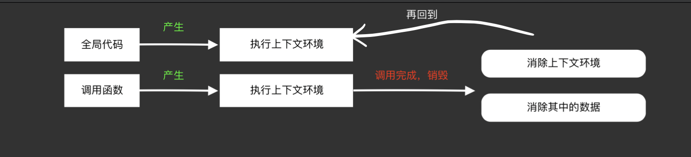
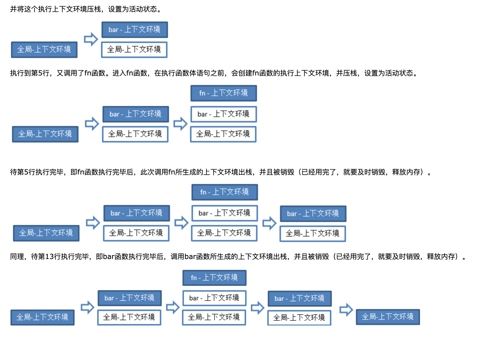

## 一 对象

**1. 一切（引用类型）皆是对象 **

- **原始类型**     值类型 
  **Undefined   Number   String   Boolean**

  ```javascript
  var x; console.log(typeof x); //undefined 未赋值的变量，它的值都是undefined，类型也是undefined; 任何变量都是可以通过设置undefined进行清空 x=undefined
  var y = 10; //number
  var z = 'name'; //string
  var k = true; //boolean
  ```

- **引用类型**
  **object **

  ```javascript
  var fn = function(){}; //function
  var arr = [];// object
  var obj = {}; //object
  ```

-  **原始类型**   基本类型
  **null**
  这个比较特殊：JS中，null被视作"nothing", 但是不幸的是，在JS中，null 的数据类型是object ; 可以将null看做JS中的一个bug, 可以通过设置null来清空一个对象

  ```javascript
  var x = null; console.log(typeof x); //object 
  也就是它的值是null, 数据类型是 object
  
  //值 undefined 实际上是从值 null 派生来的，因此 ECMAScript 把它们定义为相等的。
  console.log(null == undefined);  //true
  //但是他们俩数据类型不一样
  console.log(null === undefined); //false
  ```

---

**2.对象 — 一切属性的集合 **

> JS是弱类型语言，比较随意。 数组是对象，函数是对象， 对象还是对象。对象里面的一切都是属性， 并有且只有属性

```javascript
//对象设置属性,就是这么随意
var obj = {
  a: 10,
  b: function(x){
    console.log(this.a + x);
  }, 
  c: {
    name:'Jim',
    age: 18
  }
}

//函数设置属性
var fn = function(){};
fn.a = 10;
fn.b = function(x){
  console.log(x);
}
fn.c = {
  name:'Jim',
  age: 18
}
```

---

##  二 函数和对象的关系

**对象是通过函数创建的**

通俗点： 函数生了对象，是对象的妈妈，但是函数本身也是对象。对象生的孩子，当然还是对象。当然你不能指望儿子和妈妈就必须一模一样

```javascript
var obj = new Object();
obj.a = 10;
obj.b = "name";

var arr = new Array();
arr[0] = 10;
arr[1] = 'name';
arr[2] = true;

"语法糖"写法：
var obj = {a: 10, b: "name"};
var arr = [10, 'name', true];

本质：
typeof (Object) //function
typeof (Array) //function

小tips:
typeof Object() // object
typeof Array() //object  
原因：函数调用的优先级高于typeof运算符， 那么typeof 作用的就是一个运算结果 {} []
```

----

## 三 prototype原型

了解到，函数是一个对象，那么对象肯定就有属性。JS给了官方默认属性，起名叫做"prototype",  也就是

```
函数 = {
	prototype: value
}
```

这个value，也是一个对象obj, 既然是对象，那就一定有属性，官方又给了一个默认属性，起名叫做“constructor”。  然后呢，这个constructor 是一个指针，指回函数本身

```javascript
var fn = new Function();
console.log(fn.prototype.constructor)
ƒ anonymous(
) {

}
举个例子 jquery
```

```javascript
var $div = $('div'); //选择dom div
$div.attr('name', 'Jim');
/**
	这个例子当中，$('div')返回了一个对象，这个对象有一个属性方法，叫做attr();
	这个方法怎么来的呢，从它父亲那里接收过来的。比如他父亲是一个叫myjQuery的函数
	myjQuery.prototype.attr = function(attrname, attrvalue){
		//实现方法
	}
	$('div') = new myjQuery();
*/
```
---

## 四  __proto__ 隐形原型

**每个函数都有一个默认属性：prototype,  中文名：原型**
**每个对象都有一个默认属性：`__proto__`,  中文名：隐式原型**

```javascript
var obj = {};
console.log(obj.__proto__);

console.log(Object.prototype);

现象： 两个结果一模一样。 
结论： obj.__proto__ === Object.prototype

再给你举个例子：
var fn = function(){};
console.log(fn.__proto__);

console.log(Function.prototype);
现象：一样
结论： fn.__proto__ === Function.prototype;
```

**即：每个对象都有一个`__proto__`属性，等于他的 *创建函数* 的原型prototype**, 或者叫做指向 **创建该对象的函数**的prototype

```javascript
//需要提醒一点的是
/*
	你知道：fn.prototype = {};  和 你定义一个var obj = {}; 是一样的，都是对象(被Object创建)，所以，
	fn.prototype 也有一个__proto__,指向Object.prototype 
	**注意： Object.prototype.__proto__ =  null;  这是一个硬知识，要记忆 意思就是到头了，再没有可以往		上延伸的了
*/
重新整理，这段很重要
/**
	function Foo(name,age){
		 this.name = name;
		 this.age = age;
	};
	var fn_1 = new Foo('lianlian', 19);
	fn_1.__proto__ = Foo.prototype;
	Foo.prototype.__proto__ = Object.prototype;
	Object.prototype__proto__ = null; 
*/

```

| 对象（默认属性 `__proto__`） | 函数(默认属性 prototype) |
| ---------------------------- | ------------------------ |
| fn_1.`__proto__`             | Foo.prototype            |
| Foo.prototype.`__proto__`    | Object.prototype         |
| Object.prototype.`__proto__` | null                     |

----

## 五 instanceof

值类型：string/nubmber/boolean/undefined都可以用typeof来判断。 typeof null = 'object';

引用类型：typeof arr; typeof obj; => "object"  typeof fn; => "function"

```javascript
function Foo(name) {
  this.name = name
};
var fn_1 = new Foo('lianlian');
var fn_2 = new Foo('Amy');

fn.name //"lianlian"
fn instanceof  Foo; //true
fn instanceof Object; //true
fn instanceof Function; //false
Foo instanceof Function; //true
```

我们举个例子：

A instanceof B , 

Instanceof 的判断队则是：**沿着A的`__proto__`这条线来找，同时沿着B的prototype这条线来找，如果两条线能找到同一个引用，即同一个对象，那么就返回true。如果找到终点还未重合，则返回false**


**结论**

1. 函数本身也是一种对象，有默认属性prototype, 也有隐藏属性`__proto__`， 指向创建函数本身的函数Function.prototype

2. 所以有:

```javascript
Object instanceof Function  //true
Function instanceof Function   //true
Function instanceof Object   //true

function Foo(){};
undefined
var f1 = new Foo();
undefined
f1.__proto__ === Foo.prototype
true
Foo.prototype.constructor == Foo
true
Foo.prototype.constructor
ƒ Foo(){}
f1 instanceof Foo
true
Foo.__proto__ === Function.prototype
true
var obj = {};
undefined
obj.__proto__ == Object.prototype;
true
Object.prototype.constructor == Object;
true
Object.prototype.__proto__ == null
true
Foo.prototype.__proto__ === Object.prototype;
true
Object.__proto__ === Function.prototype;
true
Function.__proto__ === Function.prototype;
true
Function.prototype.__proto__ === Object.prototype;

```

## 六 继承

- **前言**

   JS中是没有“继承”这个概念的，后来为了图方便，硬生生的把继承给造出来了。JS中的继承就是通过原型链来体现的。

- 举个简单的小例子：

  ```javascript
  function Foo(){};
  var f1 = new Foo();
  f1.a = 10;
  
  Foo.prototype.a = 100;
  Foo.prototype.b = 200; 
  
  console.log(f1.a); //10
  console.log(f1.b); //200
  
  f1的基本属性，就有a,所以，第一层寻找到的时候，就找到啦！ 而f1.b，基本属性没有，但是创建该函数的原型上有b。 因为 f1.`__proto__` === Foo.prototype;  等量代换，f1就可以有b属性啦。
  
  ```

- **定义**

  访问一个对象的属性时，先在基本属性中找，如果没有，沿着`__proto__`这条链上找，直到找到对象老祖宗Object.prototype, 还是找不到的话，就返回undefined。**整条链上都没有，你自己实现去吧

- 如何区分属性是自己的还是继承祖辈的----hasOwnProperty

  ```javascript
  function Foo(){};
  var f1 = new Foo();
  f1.a = 10;
  
  Foo.prototype.a = 100;
  Foo.prototype.b = 200;
  
  for(var item in f1) {
    console.log(item); //a b
  }
  
  =============
  var item;
  for(item in f1) {
  	if(f1.hasOwnProperty(item)){
      console.log(item);  //a
  	}
  }
  
  ```

  

----

## 七 原型的灵活性

**特点：可以改。**嫌少了，可以添加，嫌不合适，可以改。

**explame**

```javascript
var obj = {a:10, b:20};
obj.toString(); //"[object Object]"

var arr = [10, 20];
arr.toString()  //"10,20"

现象： arr 和 obj的继承方法结果不一样，
结果： 肯定是Array.prototype.toString()方法做了修改；


```

**同理**：

自定义函数也可以修改他的原型方法

```javascript
function Foo(){}
var f1 = new Foo();

f1.toString();//"[object Object]"

修改：Foo.prototype.toString = function(){
  return 'Jim'
}

f1.toString(); //'Jim'
```

觉得方法少了，可以添加

```javascript
//首先判断这个函数上有没有该原型属性，如果有，就不要添加了。以防破坏别人修改过的原型方法。
//世上变量千千万，还怕找不到适合你的命名？？？
if(typeof Date.prototype.toJSON !== 'function'){  
   Date.prototype.toJSON = function(key) {
     return isFinite(this.valueOf()) ? '计算':null
   	}
   }
```

-----

## 八 执行上下文(环境)

小理解： 一个语句在执行时，先看看上下文，看看周边环境，然后再去判断自己要吐出什么来！

- **第一种情况**

```javascript
//第一步测试：
console.log(a);  //console.log()方法，在执行时，来回看看，环境里有没有a这个变量呢，来回看，来回看，哦，没有唉；返回错误: "a is not defined"

//第二步测试：
console.log(b); //又伸出头来，伸长脖颈，睁大眼睛，努力的搜寻环境中，有没有b嘞，b嘞！哦，有，在我底下定义着呢； 好好好，返回undefined;
var b; 

//第三步测试：
console.log(c);  //再次伸头，来回寻找，嘿！找到了，有c唉！赶紧的，返回undefined; 什么，还赋值了，我不知道哎，超出我的工作范围了，我只负责准备工作
var c = 10;
```

- **第二种情况**

```javascript
//这个情况比较特殊，是this。 是浏览器直接赋值的
//我们都知道，不论什么情况下，this都是有值的，撑死不过是就是返回window对象。
//稍后讨论
```

- **第三种情况**

```javascript
//函数声明
console.log(f1); //function f1(){}; 我们看到了this的赶脚。都是有值； 第二种情况
function f1(){};
//函数表达式
console.log(f2); //undefined  我们看到的变量声明的赶脚。第一种情况
var f2 =  function(){}
```

- **总结**

  - 变量、函数表达式----都是变量声明，默认赋值为undefined
  - this  永远有赋值  ----------------赋值
  - 函数声明（function fn）永远有赋值----------------赋值
  - **这三种数据的准备情况我们称之为“执行上下文”或者“执行上下文环境”**

  > 其实这三种情况，可以只分两种情况。一种是赋值为undefined; 一种是直接赋值。
  >
  > undefined的是var 声明的变量；
  >
  > 直接赋值的是function 声明的函数和this

------

- 看出来，以上的所有情况，都是在全局环境下执行的。

  > javascript在执行一个**代码段**之前，都会进行这些“准备工作”来生成执行上下文。这个“代码段”其实分三种情况——**全局代码，函数体，eval代码**

  - 全局代码 ： 写在script标签里面，文本形式写入

    ```javascript
    <script type="text/javascript">
      //全局代码段 ....
    </script>
    ```

  - eval代码：接收的也是一段文本形式的代码

    ```javascript
    eval("alert(123)");
    ```

  - 函数体也是代码段的原因，是因为函数在创建时，本质是 new Function(...)得来的，其中需要传入一个文本形式的参数作为函数体

    ```javascript
    function fn(x) {
      console.log(x+5);
    }
    等价于：
    var fn = new Function("x", "console.log(x+5)");
    ```

----

- **函数中**

  函数中，除了var 声明的变量和function 声明的函数以及this这几种数据外，还有其他数据。

  ```javascript
  function fn(x, y) {
  	console.log(arguments); 
  	console.log(x,y);
  }
  fn(10, 20);
  //[10,20]
  //10, 20
  fn(10);
  //[10]
  //10, undefined
  ```

  这个例子表明了： 在执行函数体内语句**之前**，arguments和参数就已经被赋值了。所以才会直接打印出来。

  **函数每被调用一次，就会执行一次上下文环境。因为每次函数的参数可能不一样，自然是要重新扫描一次**

  - > 另外有一点不同的是：函数在**定义**的时候，就已经确定了函数体内**自由变量**的作用；不是调用的时候哦！“自由变量”和“作用域”后面会有介绍

  ```javascript
  var a = 10;
  function fn() {
    console.log(a);  //a是自由变量，在创建fn的时候，就确定了a要取值的作用域。故而取10
  }
  function bar(f) {
    var a = 20;
    f();
  }
  bar(fn);  //10
  ```

---

- **全面总结整体的上下文环境**

  | 普通变量（包括函数表达式）<br />比如： var a = 10; | 声明：<br />默认赋值为undefined |
  | -------------------------------------------------- | ------------------------------- |
  | 函数声明：<br />比如： function fn(){}             | 赋值                            |
  | this                                               | 赋值                            |

  如果是函数体，那么在此基础上需要附加：

  | 参数                 | 赋值 |
  | -------------------- | ---- |
  | arguments            | 赋值 |
  | 自由变量的取值作用域 | 赋值 |

  - 通俗定义：

    > **在执行代码之前，把将要用到的所有变量都事先拿出来，有的直接赋值了，有的先用undefined占个位置**

---

- 问题抛出：在执行js代码时，会有数不清的函数调用次数，会产生多次的上下文环境。这么多的上下文环境如何管理，以及如何销毁而释放内存嘞！！！在此之前，先把this说一下


-----

## 九 this

**一句话总结：this指向调用该函数的对象！**

- 敲黑板：**在函数中this到底取何值，是在函数真正被调用执行的时候确定的，函数定义的时候确定不了**

- this的取值，可以分四种情况：

  - **情况1：构造函数**

    构造函数是用来new 对象的函数。规则锁定，首字母大写。例如：Array, Object, Function

    ```javascript
    function Foo(){
      this.name = 'lianlian';
      this.age = 18;
      console.log(this);  //Foo {name: "lianlian"}
    }
    
    var foo = new Foo();
    foo.name; //lianlian
    foo.age; //18
    ```

  - **情况2：函数作为对象的一个属性**

    ```javascript
    var obj = {
    	x: 10,
      fn: function(){
        console.log(this);
        console.log(this.x);
        console.log(x);
      }
    }
    
    obj.fn(); 
    //Object {x: 10, fn: function}
    //10
    //x is not defined
    ```

    * 敲黑板：如果fn不是作为obj的一个属性调用，结果如何？

      ```javascript
      var fn1 = obj.fn;
      fn1();
      //Window {parent: Window, postMessage: ƒ, blur: ƒ, focus: ƒ, close: ƒ, …}
      //undefined
      //x is not defined
      ```

  - **情况3：函数用call或者apply调用**

    *小小的说一下：*

    - fn.call(“绑定的对象obj", “参数1”， “参数2”， “参数3”，，，)  
    - fn.apply("绑定的对象obj", [“参数1”， “参数2”，“参数3”，，])

    ```javascript
    var obj = {
      x: 10
    }
    var mbj = {
      x: 20
    }
    function fn(){
      console.log(this);
      console.log(this.x);
    }
    
    fn.call(obj); 
    //Object {x:10}
    //10
    fn.call(mbj);
    //Object {x: 20}
    //20
    
    
    ```

  - **情况4：全局函数 & 调用普通函数**

    - 全局情况下，this永远是window。 不接受反驳和异议。

      ```javascript
      this === window; //true
      ```

    - 普通函数调用，其中的this也是window

      ```javascript
      var x = 10;
      var fn = function(){
        console.log(this);
        console.log(this.x);
      }
      fn();
      //Window {parent: Window, postMessage: ƒ, blur: ƒ, focus: ƒ, close: ƒ, …}
      //10
      ```

      *敲黑板*

      ```javascript
      var obj = {
        x: 10,
        fn: function(){
          function f() {
            console.log(this);
            console.log(this.x);
          }
          f();
        }
      }
      
      obj.fn();  或者 var f1 = obj.fn; f1();
      //Window {parent: Window, postMessage: ƒ, blur: ƒ, focus: ƒ, close: ƒ, …}
      //undefined
      解释：虽然f是在obj.fn里面定义的，但是它仍然是普通函数，所以this指向window
      ```

- 举一个jQuery源码的例子

  ```javascript
  jQuery.extend = jQuery.fn.extend = function(){
    //省略。。。。代码
    if (i === length) {
        target = this;  // 当调用jQuery.extend()或者jQuery.fn.extend()的时候， 这个this 指向 jQuery 和 Query.fn
     }
  }
  ```

----


## 十 执行上下文栈



- 处于活动状态的的上下文环境只有一个！ 

- 举例子

  ```javascript
  1. var a = 10;
  2. var fn;
  3. var bar = function(x){
  4. 	var b = 5;												3> 第三步：进入fn上下文环境
  5. 	fn(x + b);---------------------------------------------------------
  6.}																		1> 第一步：全局上下文环境
  -----------------------------------------------------------------------------
  7. fn = function(y){
  8.  var c = 8;
  9.  console.log(y + c);
  10.}
  11.																		2>第二步：进入bar上下文环境
  12. bar(15);---------------------------------------------------------
  ```

- 好了，下面就是JS开始工作了！！

  - **第一步：**准备工作--> 代码执行前，创建全局上下文环境

  - **全局上下文环境**

    | a    | undefined |
    | ---- | --------- |
    | fn   | undefined |
    | bar  | undefined |
    | this | undefined |

  - **第二步：**开始执行代码，一直到bar(15)之前，上下文环境的变量都在执行中被赋值

  - **全局上下文环境**

    | a    | 10       |
    | ---- | -------- |
    | fn   | function |
    | bar  | function |
    | this | window   |

  - **第三步：**执行到bar(15)，这一行执行完，就进入bar函数体内，在执行函数体内代码之前，创建了bar的上下文环境。压栈，状态设置为active

  - **bar-上下文环境**

    | b         | undefined |
    | --------- | --------- |
    | x         | 10        |
    | arguments | [10]      |
    | this      | window    |

  - **第四步：**bar()函数体内执行时，遇到了fn()。 在执行fn内部代码行之前，建立了fn的上下文环境，并压栈，状态为active。

- 博文原图画的很清楚

  